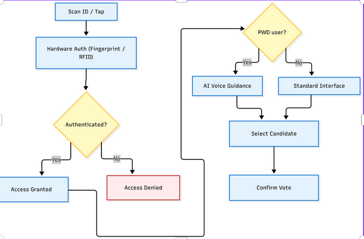
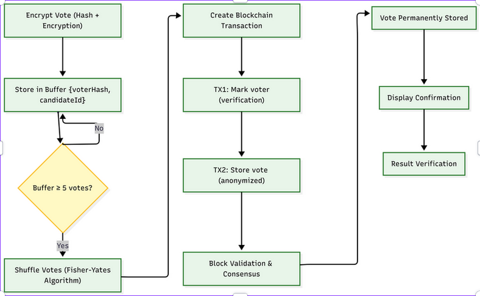

# Blockchain Agentic Vote

Privacy-focused e-voting prototype that combines Aadhaar-based voter identity hashing, batch anonymization, and on-chain tallying with an agentic, voice-guided voting flow.

## Flow

1. Voter authenticates using Aadhaar + OTP (demo) and the Aadhaar is hashed immediately.
2. Voter selects a candidate in the standard UI or via the voice-guided agentic flow.
3. Votes enter an anonymity buffer and are shuffled off-chain once a threshold is met.
4. A relayer submits two on-chain batches: voter-hash usage, then shuffled candidate IDs. Batching delays single-vote writes to reduce timing correlation and prevents linking a specific voter hash to a specific choice while keeping the final tally verifiable.
5. Admin and results views read live contract state and tallies from the chain.

## Features

-   Privacy-preserving batching that breaks identity-to-choice linkage and separates “voter used” from “vote recorded.”
-   Batching reduces on-chain writes per voter and blurs vote timing to make traffic analysis harder.
-   Agentic accessibility with strict confirmation, neutral responses, and a guided flow for assisted voting.
-   Live transparency via admin dashboard, contract state visibility, and decoded recent transactions.
-   Aadhaar hashing so raw identity is never stored or transmitted after intake.
-   Deterministic election lifecycle (setup, active, ended) enforced by the contract state machine.
-   Verifiable tallies: on-chain counts are derived from stored candidate IDs and can be recomputed.

## Security and privacy model

-   **Identity protection:** Aadhaar is hashed with a salt; only the hash is used for voter identity checks.
-   **Unlinkability via batching:** votes enter a buffer, then are shuffled before on-chain submission to reduce timing correlation and prevent direct linkage between a voter hash and a candidate choice.
-   **Two-transaction separation:** the relayer first marks voter hashes as used, then submits anonymized candidate IDs, preventing direct pairing on-chain.
-   **Double-vote prevention:** the contract records used voter hashes to block repeats.
-   **Chain integrity:** tallying and election state live on-chain; results are auditable by reading contract state.
-   **Relayer trust boundary:** the relayer performs shuffling and batching off-chain, so privacy depends on honest batching and shuffle randomness. This is a prototype tradeoff.
-   **Local chain assumptions:** security properties are demonstrated on a Hardhat local network; production deployment would require hardened key management and audited contract upgrades.
    x

## Smart contract responsibilities

The `AnonymousBallot` contract provides the minimal on-chain guarantees needed for a privacy-preserving election:

-   **Election lifecycle:** `advanceElectionState()` moves `NotStarted → Active → Ended` and emits `ElectionStateChanged`.
-   **Eligibility enforcement:** `markVoters(bytes32[])` marks hashed identities in `hasVoted` and reverts atomically if any hash already voted.
-   **Batch ingestion:** `markVoters(...)` and `recordVotes(uint256[])` are separate relayer-only calls, keeping identity and choice decoupled on-chain.
-   **Candidate validation:** `recordVotes(...)` checks `isValidCandidate` before incrementing `voteCount`.
-   **Tallying:** `voteCount`, `totalVotes`, and getters (`getVoteCount`, `getTotalVotes`) provide verifiable tallies.
-   **Events emitted:** `VotersMarked(count)`, `VotesRecorded(count)`, `ElectionStateChanged(newState)` for off-chain indexing without leaking identities or choices.

## Local blockchain

-   Uses a Hardhat local network with chainId 31337.
-   Deployment writes `data/deployment.json` (contract address, relayer, chainId) consumed by the app.
-   Relayer (Hardhat account #0) submits batch transactions; the UI reads via local JSON-RPC.

## Key modules

-   Smart contract: `contracts/AnonymousBallot.sol`
-   Deploy script: `scripts/deploy.ts`
-   Blockchain client: `lib/blockchain.ts`
-   Batch + shuffle: `actions/batch.ts`, `lib/redis.ts`, `lib/shuffle.ts`
-   Voting UIs: `app/vote/page.tsx`, `app/vote/agentic/page.tsx`, `components/VoiceAgent.tsx`
-   Admin/results: `app/admin/page.tsx`, `components/AdminDashboard.tsx`, `app/results/page.tsx`

## Flow diagrams

